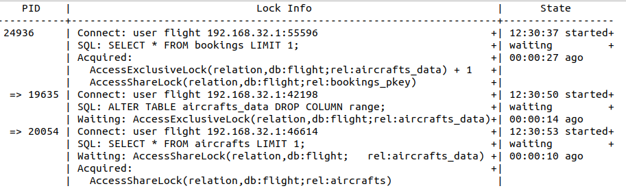
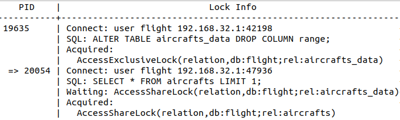

# 7 things a developer should know about databases

I dedicate this post to Michel Vayssade. 15 years ago, your courses mixed high abstraction with down-to-earth concretion, in your demanding and unadorned style. What a joy to reap again the benefit of them in understanding databases!

I also thank all reviewers: Mathieu Le Morvan - Gabriel Adgeg (OCTO), [Anne-Marie Esteves](https://fr.linkedin.com/in/annemarieesteves) (Edwyn Tech) and [Guillaume Lelarge](https://www.postgresql.org/community/contributors/) (Dalibo).

## TL;DR

Full-stack and back-end developers, you probably don't know this - and it can you get out of trouble:

- `pg_stat_activity` view shows executing queries, `pg_stat_statements` shows executed queries, queries can be logged;
- use a connection pool; make sure when scaling you do not reach `max_connections`;
- activate `default_transaction_read_only` and `statement_timeout` in your sql client in production;
- never login to production directly in the database OS/container: use a sql client instead;
- if `pg_stat_activity` shows queries waiting for lock, use the lock view to find which ones got them;
- when a SQL query has started, it will run until completion - doesn't matter if the client is gone;
- use `pg_terminate_backend` to stop a query, and be ready for AUTOVACUUM.

## Why should I care?

99% of the time, developers don't have to care about databases. As long as they practice the basics they learned in initial training (a sound - and versioned - data model, consistency with transaction, and some index for performance), they don't have to think much about it. The database is a nice black box. As for me, a web developer, I enjoy learning database internals for fun: it gives me the kind of thrill I only got in systems programming courses.

Over the years, I've come to realize that some bits of what I learned from internals were useful for anyone. Actually, these bits may come and bite you harshly in production. So, instead of laughing under my breath when these things happen to others, I'm going to share them now.

My first idea was to produce "an emergency kit", but thanks to Tom Kyte (from the introduction of his book "Effective Oracle by Design") I've included preventive knowledge, especially concurrency. As we have to know so many things, I've kept the list short. For the same reasons, I only cover PostgreSQL, being the most used relational database these days by our clients.

## Preventive healthcare

### Know your database

<!-- markdownlint-disable-next-line MD036 -->
**TL;DR: pg_stat_activity view shows executing queries, pg_stat_statements shows executed queries, queries can be logged**

First things first: before going live, make your database observable.

> In other words, the question isn’t whether you should do it but how you should do it.

Christian Antognini in [Troubleshooting Oracle Performance](https://antognini.ch/top/)

When bad things will happen in production (and they will), it will be too late to realize you don't know what is actually happening. From the project's onset, in the [walking skeleton](https://wiki.c2.com/?WalkingSkeleton) - the first time code is deployed on a remote environment, you should know which queries are under execution in the database.

A native PG view does exactly that: [pg_stat_activity](https://www.postgresql.org/docs/current/monitoring-stats.html#MONITORING-PG-STAT-ACTIVITY-VIEW). It mentions which user is executing which query on which database, and the status of this query: is it waiting for the disk, is it waiting for a lock?

Make your job easier:

- identify the component which launched the query by setting [application_name](https://www.postgresql.org/docs/current/libpq-connect.html#LIBPQ-CONNECT-APPLICATION-NAME) when connecting, e.g. with your container id;
- display the full query text increasing [track_activity_query_size](https://www.postgresql.org/docs/current/runtime-config-statistics.html#GUC-TRACK-ACTIVITY-QUERY-SIZE).

Once you've got this set and easily accessible (some PaaS offer a web view), you need to know what happened at a specific time, e.g. when the response time increased last friday night. Do it the same way you do with your nginx router: write events in the log, in standard output, and ship them using a log collector.
To do so, use the built-in PG feature, which logs queries upon completion. You can enable it for queries which exceed some duration, say 10 seconds using [log_min_duration_statement](https://www.postgresql.org/docs/current/runtime-config-logging.html#GUC-LOG-MIN-DURATION-STATEMENT) parameter. I advise you to try logging all queries: if your logs get too big, you can always reduce the retention size. Most platforms come with built-in monitoring tools to get CPU, RAM and I/O (disk and network). If you send these metrics and your query logs into a dataviz tool, you'll be ready in case something happens in production.

If you still need more, like optimizing your queries, you'll need a statistics tool. While optimization should be done at the application level, using an [APM](https://en.wikipedia.org/wiki/Application_performance_management), you can get statistics quickly in the database using [pg_stat_statements](https://www.postgresql.org/docs/current/pgstatstatements.html). It's not active by default, as it adds some overhead, but it's worth throwing a glance.

### Concurrency is not an abstraction

<!-- markdownlint-disable-next-line MD036 -->
**TL;DR: use a pool; make sure when scaling you do not reach max_connections**

You may think concurrency is a concern for programming language designers or architects, something you shouldn't worry about, something that has been taken care of at the beginning of the project. Well, if you want to ride full throttle, make sure it has been correctly handled for the database.

Let's consider the most complex case: we deploy a REST API back-end on a PaaS which offers horizontal auto-scaling, plus DBaaS. It's complex because we should provide the best service level to all clients (application containers), and their number changes over time.

We should consider 2 levels:

- inside the database:
  - how to make the best use of bounded resources, namely CPU and I/O;
  - minimizing the costly operation of handling a new client connection (it involves an OS process creation);
- outside the database:
  - how to avoid network roundtrips linked to opening database connections;
  - managing client scaling: serve a single client or many of them, fairly and efficiently.

#### Configure the allowed maximum number of connection

PostgreSQL allows a maximum number of client connections that you can configure : [max_connections](https://www.postgresql.org/docs/current/runtime-config-connection.html#GUC-MAX-CONNECTIONS).

Concurrency tells you NOT to configure it considering how many clients will connect to the database. It tells you to consider your database resources - and open a few connections as possible. If you want to understand why, read [this post](https://github.com/brettwooldridge/HikariCP/wiki/About-Pool-Sizing#but-why) carefully.

To estimate the maximum number of client connections your database can handle effectively, you should consider database :

- usage (REST API or datawarehouse);
- count of CPU core;
- I/O technology (SSD or HDD) and number of I/O devices.

The key point is : **if you use a value too high, the global response time (time elapsed to process all queries) may increase**.

If you use a DBaaS, this will be done for you: jump to next section.

If you don't use a DBaaS, your DBA has done it for you and run performance tests to check.

If there is no DBA:

- set a value;
- run performance tests;
- change the value and compare.

You can start with:

- fixed values: `200` in a REST API, `40` for datawarehouse platform, as recommended by [pgtune](https://github.com/le0pard/pgtune/blob/9ae57d0a97ba6c597390d43b15cd428311327939/src/features/configuration/configurationSlice.js#L107);
- do some calculation according to [Postgresql Wiki](https://wiki.postgresql.org/wiki/Number_Of_Database_Connections) below.

```text
max_connections = (core_count * 2) + effective_io_concurrency
```

`effective_io_concurrency` is the number of access the storage devices can handle simultaneously:

- for one HDD drive, `effective_io_concurrency` = 1;
- for one SDD drive, it will be much higher.

#### Use a properly-configured pool

As the database dictates the maximum number of connections, any connection request from your backend will bounce back if this number is reached. You should make sure this doesn't happen. You also want to minimize creating new connections between client and database, which is costly both for databases and clients. The idea is to reuse the same connection, issuing many SQL queries against it. There are many options, but usually for REST backend, a connection pool in your backend container (as a library) is the way to go.

Configure it to make sure each backend connection pool opens **at most** `max_connections / backend_container_count`. The straightforward method is to consider all clients containers are always active, and set this value on container startup. This may lead to suboptimal use when few containers are active. Dynamic pool-sizing can be considered, but this will introduce complexity ( e.g. downsize existing containers pool size when another container starts). Make sure it's worth implementing it, using performance tests beforehand.

### Ride safe

<!-- markdownlint-disable-next-line MD036 -->
**TL;DR: activate default_transaction_read_only and statement_timeout in your sql client in production**

Connecting to production to monitor queries using any general-purpose client, say `psql`, can be risky. If your database user can query tables, and you paste some long query in (what you thought was) the development environment, you can slow down the whole database. Of course, you can even corrupt data if you have write privileges. Your boss may reply "but you should take care of what you're doing". I disagree.

> Make it hard to do something wrong.

#### read-only

If you can't get a read-only account from your DBA, turn by yourself your session read-only.

```postgresql
SET default_transaction_read_only = ON;
```

Please do so programmatically, using a pre-connection hook like [.psqlrc](https://www.postgresql.org/docs/current/app-psql.html#APP-PSQL-FILES-PSQLRC) file.

#### execute short queries

When your session is read-only, you cannot corrupt data. You can still hoard resources (thus degrading service level for other users) by executing resources-intensive and long-running queries. Prevent that by setting a timeout (here, one minute).

```postgresql
SET statement_timeout = 60000;
```

#### do not preempt access

A special case of resource hoarding is concurrent access. If you modify data, a lock should be granted, and another session may wait for it (more on this in [locks are not evil](#locks-are-not-evil)). This can be nasty if a deployment involving this resource is blocked. Set a lock timeout to ten seconds and relax.

```postgresql
SET lock_timeout = 10000;
```

#### know your rollback

Sometimes, you actually need write privileges for troubleshooting. Your plan is to start a transaction, do some INSERT/UPDATE/DELETE, and then rollback the transaction; as if nothing actually happens.

Well, nothing has happened as far as other transactions are concerned. But something did actually happen in data files, on the filesystem: all the changes made by your transaction are there : they are known as dead tuples. I would be delighted to tell you more, as it's a great way to learn MVCC, but I'm running short of time.

These tuples take disk space that will eventually be reused for other tuples after a [VACUUM](https://www.postgresql.org/docs/current/sql-vacuum.html) completes. This is done automatically, but takes resources (CPU and I/O). If you update much data, database response time may increase when the AUTOVACUUM does its job.

So, when you do such things, keep an eye on response time: if it goes up, look at [pg_stat_progress_vacuum](https://www.postgresql.org/docs/current/progress-reporting.html) to check if an AUTOVACUUM has started and estimate when it will complete.

Do not update huge tables, as it may lead to the dreaded `no space left on device`.

### Don't mix clients and server

<!-- markdownlint-disable-next-line MD036 -->
**TL;DR: never login to production database OS/container: use a sql client instead**

Always connect remotely. Do NOT connect to the database server itself using a remote shell (if using VM), nor connect to container (if using docker).

Issuing commands directly on the database OS can lead to nasty situations:

- to stop a query, you stop the corresponding OS process using `kill -9 $PID` and ... the database goes into recovery mode;
- to monitor the database, you schedule a healthcheck query running in the database OS and ... [the database crashes](https://www.cybertec-postgresql.com/en/docker-sudden-death-for-postgresql/).

If you don't understand why this is happening, relax. As a developer, you're not expected to know each and every side effects of Linux process handling. To be on the safe side, do not mix client with server concerns.

You may object you wouldn't do such things, but you need "just once":

- to import a huge CSV data file, and don't want to store sensible data out of the database;
- launch long-running queries, and not worry about timeout.

Sure. Just because you can doesn’t mean you should.

I strongly suggest to use a separate client:

- if working on a Paas, use some one-off container;
- if not, use a lightweight scheduler (some even run in the database: [pg_timetable](https://github.com/cybertec-postgresql/pg_timetable), [pg_boss](https://github.com/timgit/pg-boss)).

This may appear as extra work for nothing; in fact, it will save you much trouble.

## In the emergency room

You've followed all previous rules and, well, bad things are actually happening. What can you do? You can exercise before bad things happen, so you can keep a cold head when things turn hot, the telephone keeps ringing and your manager keeps sneaking over your shoulder. So, read the following and practice with a colleague who plays the devil's role, pushing bugs and running rogue queries into (a maybe fake) production.

### Locks are NOT evil

<!-- markdownlint-disable-next-line MD036 -->
**TL;DR: if pg_stat_activity shows queries waiting for a lock, use the lock tree view to find which ones got them**

This advice is the most complex of the whole post, so I used an example to help you get through it. Don't be afraid by the length of this section.

#### locks are good

Some API calls are way too long, and you found using `pg_stat_activity` that the underlying SQL query is under execution, waiting for a lock. You mumble against locks, but think twice. Locks are good: without them, no concurrency can ever happen. PostgreSQL locks are fine-grained (on row, partition, table) and many tricks are performed so, except for DDL, "reader doesn't lock writers, and writer doesn't block readers".

What's bad is resource starving: if your query is waiting for a lock to be granted, it's because another query has not released it. Locks are managed in FIFO queue: there is no shortcut to have lock granted sooner. What you need is to find the blocking query, and check why it hasn't released the lock yet.

#### locks and multiple queries transaction

By default, each statement is executed in a single transaction, which is implicitly committed.
You can make your transaction span several queries, creating a transaction explicitly with `BEGIN TRANSACTION`.

If so, two more rules apply:

- locks are requested as late as possible, not at the beginning of the transaction;
- locks are released at the end of the transaction.

That means a transaction can pause after one query, waiting for a lock grant, thereby blocking another query. Transitively, a transaction can block many other ones.

#### who's blocking?

Well, to find who's not releasing the lock, `pg_locks` native view is not the way to go for most humans. Use [this query](https://wiki.postgresql.org/wiki/Lock_dependency_information#Recursive_View_of_Blocking) instead, which displays the lock tree.

<!-- markdownlint-disable-next-line MD033 MD045 -->


First, consider the structure:

- on the first line, unindented, stays the first node, with its PID 24936;
  - this node is a session which is not blocked by anyone: it may be working, or idle;
  - this node is a called a root node, a tree may have several root nodes (it would be a forest);
- under each node, each indent to the right shows the session it blocks
  - e.g. session 24936 is blocking two sessions : 19635 and 20054
  - this can go on as deep as necessary: a session blocked may in turn block another

In lock info, you find:

- in `SQL`, the last query it has executed;
- in `Acquired`, the lock it has been granted : 24936 has a `AccessExclusiveLock` lock on `aircrafts_data` table;
- in `Waiting`, the lock it has requested and is waiting for: 19635 waits for `AccessShareLock` on `aircrafts` view.

In state, you find when the session has started and its status (active or waiting).

If you look at the SQL text in `pg_stat_activity`, you can't guess that 24936 is blocking 19635: the lock is on `bookings` but the SQL text mentions `aircrafts_data`. That's why you need the lock tree.

#### lock and zero-downtime migration

If you're not interested in ZDD, skip this section, as it's still more complex.

If you cause session 24936 to complete, what will happen?
You may think the other two sessions will be unblocked and both run. Unfortunately, no.
The first session that requested the lock on the table will get it, this is 19635 with `AccessExclusiveLock`.
And because the `AccessExclusiveLock` is the most restrictive lock, even session 20054 with its weak `AccessShareLock` will still have to wait.

When you check the lock tree, you can see that session 20054:

- which was a sibling of session 19635;
- is now its child.

<!-- markdownlint-disable-next-line MD033 MD045 -->


To sum up, you can't read the future directly in the lock tree, you'll have to think a little bit.
You need to know which lock is in conflict with another: [check the documentation](https://www.postgresql.org/docs/current/explicit-locking.html#LOCKING-TABLES).

The scenario I chose may look strange: it's simulating database schema migration in ZDD context.

To get ZDD in database schema migration:

- to be executed, deployment should not be blocked (for a long time) by application queries;
- when executing, deployment should not block (for a long time) application queries.

To do so, use [pglocks](https://pglocks.org/?pglock=AccessExclusiveLock) to find out :

- first, which lock your migration will request;
- next, which application statements may prevent your migration;
- then, which application statement will be blocked by your migration.

### Keep contact, cause the database won't

<!-- markdownlint-disable-next-line MD036 -->
**TL;DR: when a SQL query has started, it will run until completion - doesn't matter if the client is gone**

What happened to the query you launched from your laptop, just before you spill your coffee? To the query your colleague kicked before lunch on his machine (coz' it's sooo long, and fewer people are using the database at noon), but had to unplug hastily from the network to come back home?

These queries are similar to orphaned processes: their parent processes are not alive anymore. The query is still running in the server (the database) but the client is gone. What will happen then?

Your boss may reply that nobody should ever launch queries from their desktop, cause our private laptop and network are notoriously unreliable. Adding to that, queries should be quick, not long-running. Well, you've got a point here. But even remote one-off containers times out. Timeouts are not evil, they're a way to ensure you don't wait forever, with a call stack growing forever. You should plan for failure as [in 12-factor app](https://12factor.net/disposability).

Many proxies have a timeout, like the proxies ahead of REST API, that's what [HTTP 504 error code](https://developer.mozilla.org/en-US/docs/Web/HTTP/Status/504) is for. So, what happens to a REST API call that timeout, while PG is executing a query? Frameworks differs: by default, Node's HapiJs go on processing the SQl query, and when it returns the response to the front-end, it finds a closed socket. Therefore, if bad things happen in production, it may be because your front-end is making consecutive API calls, each one triggering a SQL query which times out. The same SQL query is executing again and again, using database resources for nothing. You can find such occurrences if you monitor your API queries and running SQL queries. Maybe you can [add custom code](https://github.com/hapijs/hapi/issues/3528) to ask PG to cancel the query on client disconnection, but for now you need to stop those queries.

If we came back to the queries we talked about at the very beginning (coffee and lunch), what happens when the sql client is gone? By default, PostgreSQL will generally NOT know about client disconnection. It is notified only if your client notify him gracefully before leaving, e.g. if you hit Ctrl-C in `psql`. So these queries will go on. If you need to stop them, let's see how to do this properly in the next (and last!) chapter.

https://www.cybertec-postgresql.com/en/tcp-keepalive-for-a-better-postgresql-experience/

### Know how to terminate

<!-- markdownlint-disable-next-line MD036 -->
**TL;DR: use pg_terminate_backend to stop a query, and be ready for AUTOVACUUM**

Someone/thing has connected to production and started a query, but you don't want this query to run anymore.

It may be because:

- the client is gone and the query alone is useless;
- the query is wrong, and corrupts data (a bug);
- the query is greedy on resources, and slow down everyone (a bug?);
- the query is long, and you badly need your ZDD database migration to run.

The only proper way to do this is using a SQL client:

- to cancel the current query on the connection, use `pg_cancel_backend($PID)`;
- to stop the whole connection, use `pg_terminate_backend($PID)`.

`$PID` is the id of the process who is handling the connection, found in `pg_stat_activity`. If you're unsure on how to do this, refer to [this](https://www.cybertec-postgresql.com/en/terminating-database-connections-in-postgresql/).

Keep in mind that the transaction in which these queries run will be rollbacked, which means some AUTOVACUUM can happen afterward (you remember [Locks are not evil](#locks-are-not-evil), don't you?).

### Ask for help

If you've read and applied these 7 pieces of advice, and are still in trouble, you can now ask for help from your database administrator in complete confidence. If you come to him with all the clues you've collected, his job will be much easier, and you can work as one team.

A typical case is a slow query: monitoring your database, you find a query blocking many others for a long time. This query should process little data, so it should be short-lived; but you found it's executed many times each day and lasts a few minutes. When you come to him with this query, he can focus on finding out why it is slow. He will use execution plans and come back to you talking about indexes, partitions and statistics, things you're not familiar with. If you had come to him saying "this database is damn slow", he would have to browse all queries by himself and make guesses, and spend much more time.

Before parting, let me slip a last thing in your pocket, a quote from Mikko Hypponen.
> Rarely is anyone thanked for the work they did to prevent the disaster that didn't happen.
